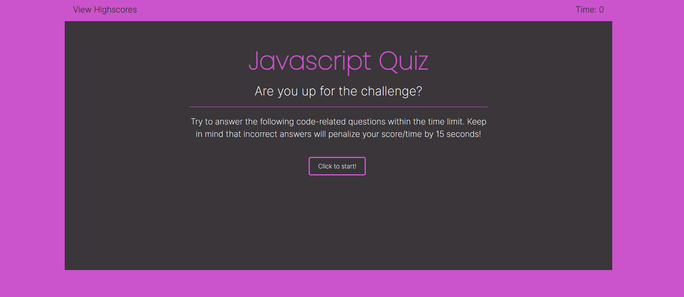

# Javascript Quiz

This is a timed coding quiz with multiple choice questions about Javascript. 
Users have 75 seconds to answer 6 questions. Each question answered correctly will score 10 points, however if it is incorrect, you will lose 2 points and the time will be deducted by 15 seconds. 
At the end, users can record their score and this will be added to the existing list of high scores. 
It runs on the browser using HTML, CSS and Javascript. 

## Preview of the code quiz

